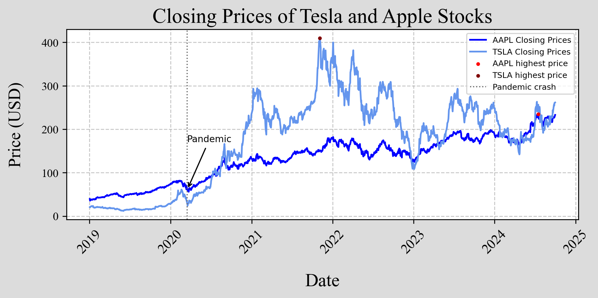

# Portfolio - Daniel Nunes Vital
### nunesvitald@gmail.com
I have listed below a few projects I have undertaken using R, Python, and LaTeX. *More projects can be found [here]().*

# Exploring the PNADc  
In this project, I used the PNADcIBGE package to colect data from the Continuous National Household Sample Survey (PNADc) which surveys general characteristics of the brazillian population, such as education, income and labor. Using the obtained microdata, it is possible to calculate multiple variables and rates for the brazilian economy. Among the various information I calculated, some are:  
* Brazilian unemployment rate: 6,32%
* Unemployment rate of the Recife Metropolitan Region: 11,81%
* Average income of the brazilian population: 3267.7 reais, average income of the brazilian woman: 2817.6 reais, average income of the brazilian man: 3605.2 reais and the average income of the black woman in the state of Pernambuco: 2151.2 reais.
* The percentage of white women between the ages of 20 and 30 who are currently unemployed: 8,479%.
* The racial composition of the Brazilian population (approximated values): 42% are white, 10% are black, 0.6% are asians, 46% are brown, 0.4% are indigenous, 0,01% ignored. (The definition of each race is according to the Brazillian institute of Geography and Statistics).

*All the information is from the third quarter of 2024*  
The research offers significant contributions to a wide range of applications. The derived data enables a thorough assessment of the country's economic state. With the package I used, it is possible to select specific variables from the survey without the need to download all the information collected by the IBGE, however, it still is a large quantity of data to work with. 
[Click here to access the code]()  

# Default on the credit portfolio of individuals and legal entities in Brazil
With the package that accesses data through the Central Bank of Brazil's API, I computed the monthly default rate for both individuals and corporations (please, check the definition) from 2011 to 2024. Utilizing ggplot2, I generated a graph and animated it to depict the dynamic changes in the rates over time.  

   

  

The Definition according to the website of the Central Bank of Brazil is: *Percentage of the National Financial System's loan portfolio with at least one installment more than 90 days overdue. This includes operations contracted in both the free credit and directed credit segments.* [Verify here](https://dadosabertos.bcb.gov.br/dataset/21083-inadimplencia-da-carteira-de-credito---pessoas-juridicas---total)  

[Click here to access the code]()  

# Closing prices of Tesla and Apple stocks

   

  

