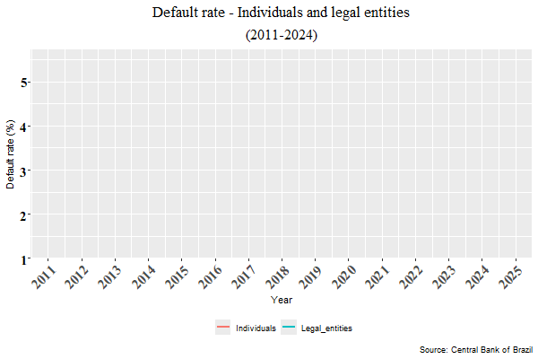
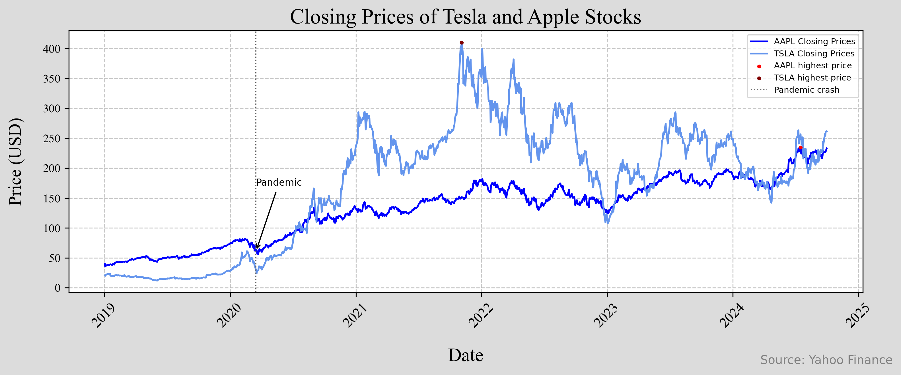
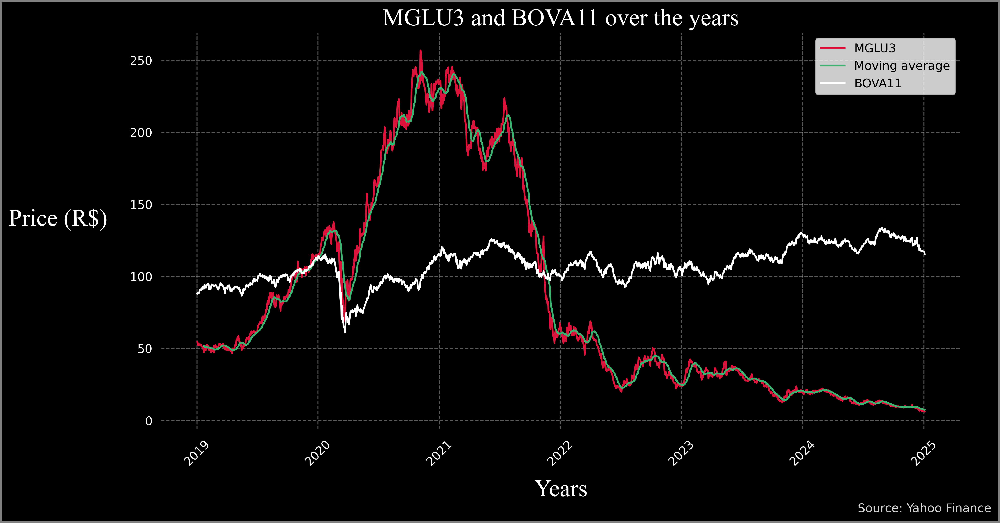

# Portfolio - Daniel Nunes Vital
### nunesvitald@gmail.com
I have listed below a few projects that I have completed using R, Python, and LaTeX. *More projects can be found [here](https://github.com/Danieldnv).*

# Exploring the PNADc  
 In this project, I used the PNADcIBGE package to collect data from the Continuous National Household Sample Survey (PNADc), which surveys general characteristics of the Brazilian population, such as education, income, and labour. By Applying functions from the "survey" and "convey" packages on the obtained microdata, it is possible to calculate numerous indicators and rates for the Brazilian economy. Among the various pieces of information I calculated are:  
* Brazilian unemployment rate: 6.4%
* Unemployment rate in the Recife Metropolitan Region: 11.81%
* The average income of the Brazilian population: 3,267.7 reais; average income of the Brazilian woman: 2,817.6 reais; average income of the Brazilian man: 3,605.2 reais; and the average income of the black woman in the state of Pernambuco: 2,151.2 reais.
* The percentage of white women between the ages of 20 and 30 who are currently unemployed: 8.479%.
* The racial composition of the Brazilian population (approximated values): 42% are white; 10% are black; 0.6% are Asian; 46% are brown; 0.4% are indigenous; and 0.01% ignored (The definition of each race is according to the Brazilian Institute of Geography and Statistics).  

*All the information is from the third quarter of 2024*  
The research offers significant contributions to a wide range of applications. The derived data enables a thorough assessment of the country's economic state. 
[Click here to access the code](https://github.com/Danieldnv/portfolio_english/blob/main/codes/pnad_portfolio_en.R)  

# Default on the credit portfolio of individuals and legal entities in Brazil
With the package that accesses data through the Central Bank of Brazil's API, I collected the monthly default rate for both individuals and corporations (please check the definition) from 2011 to 2024. Utilizing ggplot2, I generated a graph and animated it to depict the dynamic changes in the rates over time.  

   

  

The definition according to the website of the Central Bank of Brazil is: *Percentage of the National Financial System's loan portfolio with at least one installment more than 90 days overdue. This includes operations contracted in both the free credit and directed credit segments.* [Verify here](https://dadosabertos.bcb.gov.br/dataset/21083-inadimplencia-da-carteira-de-credito---pessoas-juridicas---total)  

[Click here to access the code](https://github.com/Danieldnv/portfolio_english/blob/main/codes/animated_plot_portfolio.R)  

# Closing prices of Tesla and Apple stocks  
Utilizing the "yfinance" library, I collected information about Tesla and Apple stocks through Yahoo Finance's APIs. From the obtained data, I separated the closing prices and generated a visual representation, illustrating, for both stocks, the main impact of the COVID-19 pandemic on the prices, and the highest price between 01/01/2019 and 10/01/2024 
It can be observed that, despite a significant drop during COVID-19, the prices of both stocks demonstrated a strong recovery.

   

  

[Click here to access the code](https://github.com/Danieldnv/portfolio_english/blob/main/codes/tesla_apple.ipynb)  

# MGLU3, BOVA11, Dollar and Ibovespa

In this project, also using "yfinance", I conducted an analysis of BOVA11 (an ETF that tracks the Ibovespa index) and MGLU3 (a company called Magazine Luiza. It is one of the main retailers in Brazil), visualizing the results in a graph, which includes the closing prices and Magazine Luiza's moving average.  
Additionally, I collected information about the Ibovespa index and the US dollar (quoted in reais). An important point to highlight is the performance following the adjustment of the SELIC rate (Brazil's basic interest rate): the dollar did not respond as expected to a rise in the interest rate, indicating that the country's fiscal and political situation is suppressing the effects of the SELIC adjustments. Subsequently, in December 2024, the monetary policy committee raised the interest rate by 1%, yet the dollar reached historic highs.

   

  

   

  

[Click here to access the code](https://github.com/Danieldnv/portfolio_english/blob/main/codes/stock_dolar_ibov2.ipynb)  

# LaTeX  
While not directly related to data science, the skills I developed while creating these projects enable me to provide significant contributions through LaTeX documents, which are important for producing high-quality reports for clients or internal company use. This programming language is excellent for writing mathematical symbols, equations, plotting graphics, and text with technical characteristics.  
Among the packages I used in these documents are: amsmath, amssymb, graphicx, pgfplots, and tikz.  

Samples of my work are presented below. These documents were created for personal use during exam preparation and served as summaries of the studied content.

## Calculus - LaTeX  

   

  

[Click here to access the code](https://github.com/Danieldnv/portfolio_english/blob/main/codes/calculustex.tex)  

## Statistics - LaTeX  

   

 

[Click here to access the code](https://github.com/Danieldnv/portfolio_english/blob/main/codes/statisticstex.tex)  
